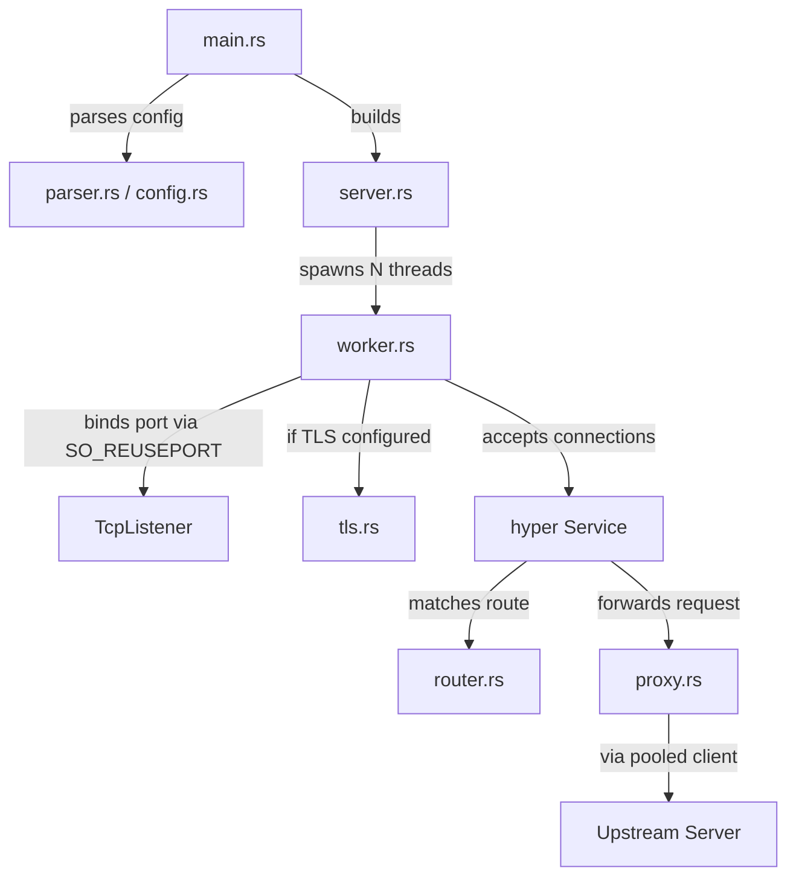

# Barebones-Reverse-Proxy

A high-performance and modular reverse proxy built in Rust using the `hyper` ecosystem.

## Features

- **HTTP/1.1 & HTTP/2 Support**: Auto-negotiates the best available protocol.
- **HTTPS Termination**: End-to-end TLS support with ALPN.
- **Multi-threaded Worker Pool**: Uses `SO_REUSEPORT` to distribute load across multiple CPU cores with independent acceptor loops.
- **Connection Pooling**: Efficient upstream connection management for minimal latency.
- **Request Rewriting**: Flexible path mapping and automatic header injection (`X-Forwarded-For`, `X-Real-IP`, `Host`).
- **Modular Architecture**: Clean separation of concerns across 8 internal modules.

## Getting Started

### Installation & Execution
1. Clone the repository.
2. Create a `proxy.conf` (see [Configuration](#configuration) below).
3. (Optional) Place your SSL certificate and key in `.env/`.
4. Run the server:
   ```bash
   make run
   ```

## Make Commands

| Command | Description |
|---|---|
| `make build` | Compile the project in debug mode |
| `make run` | Compile and start the proxy server |
| `make test` | Run the unit and integration test suite |
| `make check` | Run a quick compilation check |
| `make lint` | Run Clippy for static analysis |
| `make fmt` | Format the codebase |
| `make release` | Build a production-optimized binary |
| `make clean` | Remove build artifacts |

## Architecture Overview

The system is designed with a "shared-nothing" concurrency model where each worker thread runs its own independent event loop.



- **server.rs**: Orchestrates the startup and lifecycle of worker threads.
- **worker.rs**: Manages a dedicated Tokio runtime and accept loop per thread.
- **proxy.rs**: The core proxy logic implementing the Hyper `Service` trait.
- **router.rs**: Encapsulates prefix-based route matching and URI rewriting logic.
- **tls.rs**: Handles certificate loading and TLS acceptor configuration.

## Configuration

The proxy is configured via `proxy.conf`. Example:

```protobuf
listen 8080;
workers 4;

# Optional TLS configuration
https-cert .env/cert.pem;
https-key .env/key.pem;

# Route mapping: <request_endpoint> <forward_endpoint>
route https://localhost:8080/api http://localhost:3000/add;
```