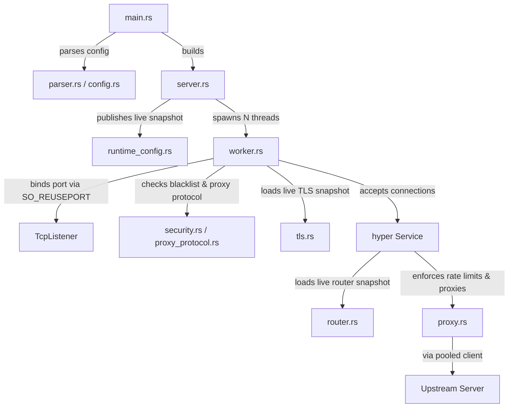

# Barebones-Reverse-Proxy


A high-performance and modular reverse proxy built in Rust using the `hyper` ecosystem.

## Features

- **HTTP/1.1 & HTTP/2 Support**: Auto-negotiates the best available protocol.
- **HTTPS Termination with SNI**: Selects the correct certificate for each requested hostname during the TLS handshake.
- **WebSocket Support**: Seamless HTTP Upgrade bridging for WebSocket connections.
- **Zero-Downtime Config Reload**: Reload routes, logging configuration, and TLS certificates with `SIGHUP` without restarting the process.
- **Multi-threaded Worker Pool**: Uses `SO_REUSEPORT` to distribute load across multiple CPU cores with independent acceptor loops.
- **Configurable Bind Addresses**: Granular control over server network binding interfaces (e.g., `127.0.0.1:443`).
- **File & Console Logging**: Configurable structured logging with zero-downtime log file rotation.
- **Connection Pooling**: Efficient upstream connection management for minimal latency.
- **Request Rewriting**: Flexible path mapping and standards-compliant header proxying (preserves `Host`, injects `X-Forwarded-*`).
- **Active Security Defense & Hardening**:
  - **In-Memory TLS Failure Blacklist**: Automatically flags and bans IPs triggering excessive TLS handshake failures (> 5 within 60s).
  - **Zero-CPU Socket-Level Filtering**: Immediately drops raw TCP connections from blacklisted IPs before cryptographic TLS processing.
  - **Strict Request Rate Limiting**: Returns `HTTP 429 Too Many Requests` (with `Retry-After: 60`) when a client exceeds rolling request thresholds.
  - **Catch-All HTTP 444 "No Response" Handler**: Immediately returns HTTP 444 with empty body to starve scanners searching unrouted paths (`/robots.txt`, `/.env`).
  - **Dynamic SNI Verification**: Aborts TLS handshakes immediately for bare IP queries or unowned SNI hostnames before routing evaluation.
  - **Forward Authentication & SSO Middleware**: Decoupled `AuthProvider` trait supporting Authelia / Authentik (TouchID/FaceID Passkeys, 2FA, API keys) with route-level `auth on / off` controls.
  - **Proxy Protocol v1 & IP Anti-Spoofing**: Preserves origin IPs behind trusted load balancers with strict untrusted source rejection.
- **Modular Architecture**: Clean separation of concerns across 11 internal modules.

## Getting Started

### Installation & Execution
1. Clone the repository.
2. Create a `proxy.conf` (see [Configuration](#configuration) below).
3. (Optional) Configure one or more certificate blocks for HTTPS termination.
4. Run the server:
   ```bash
   make run
   ```

## Make Commands

| Command | Description |
|---|---|
| `make build` | Compile the project in debug mode |
| `make run` | Compile and start the proxy server |
| `make reload` | Reload the systemd service config via `systemctl reload` |
| `make test` | Run the unit and integration test suite |
| `make check` | Run a quick compilation check |
| `make lint` | Run Clippy for static analysis |
| `make fmt` | Format the codebase |
| `make release` | Build a production-optimized binary |
| `make clean` | Remove build artifacts |

## Architecture Overview

The system is designed with a "shared-nothing" concurrency model where each worker thread runs its own independent event loop.


```mermaid
graph TD
    A[main.rs] -->|parses config| B[parser.rs / config.rs]
    A -->|builds| C[server.rs]
    C -->|publishes live snapshot| RUNTIME[runtime_config.rs]
    C -->|spawns N threads| W[worker.rs]
    W -->|binds port via SO_REUSEPORT| L[TcpListener]
    W -->|checks blacklist & proxy protocol| SEC[security.rs / proxy_protocol.rs]
    W -->|loads live TLS snapshot| D[tls.rs]
    W -->|accepts connections| E[hyper Service]
    E -->|loads live router snapshot| F[router.rs]
    E -->|enforces rate limits & proxies| G[proxy.rs]
    G -->|via pooled client| H[Upstream Server]
```

- **server.rs**: Orchestrates the startup and lifecycle of worker threads.
- **runtime_config.rs**: Builds and publishes immutable live config snapshots for workers to read.
- **security.rs**: Thread-safe manager for TLS failure tracking, IP blacklisting, TTL ban eviction, and request rate limiting.
- **proxy_protocol.rs**: Handles Proxy Protocol v1 header parsing and anti-spoofing verification.
- **worker.rs**: Manages a dedicated Tokio runtime, pre-TLS socket-level drops, and accept loop per thread.
- **proxy.rs**: The core proxy logic implementing the Hyper `Service` trait, including rate-limit checks and response rewriting.
- **router.rs**: Encapsulates prefix-based route matching and URI rewriting logic.
- **tls.rs**: Builds the SNI-aware TLS acceptor and loads hostname-specific certificate/key pairs.

## Documentation

For a deeper dive into technical internals and security mechanisms, see:

- [Security & Network Hardening](docs/security.md)
- [Architecture Overview](docs/architecture.md)
- [Worker Threads & SO_REUSEPORT](docs/workers.md)
- [Event Loop & Task Scheduling](docs/event_loop.md)

## Configuration

The proxy is configured via `proxy.conf`. It supports C-style comments (`//` and `/* */`). Example:

```protobuf
// Bind to a specific interface and port, or just a port (defaults to 0.0.0.0)
listen 127.0.0.1:443;
workers 2;
logfile /var/log/proxy.log;

security {
    proxy_protocol off;
    max_tls_failures 5;
    ban_duration 3600;
    rate_limit_rpm 300;
}

route https://dashboard.asahi.tailbce682.ts.net/ {
    upstream http://localhost:3000/;
    cert /var/lib/tailscale/certs/dashboard.crt;
    key /var/lib/tailscale/certs/dashboard.key;
}

route https://grafana.asahi.tailbce682.ts.net/ {
    upstream http://localhost:3001/;
    auth on;
    cert /var/lib/tailscale/certs/grafana.crt;
    key /var/lib/tailscale/certs/grafana.key;
}
```

## Reloading Config

On Unix systems, the proxy reloads `proxy.conf` on `SIGHUP`.

- Route and log file changes apply to new requests immediately.
- Hostname-specific TLS certificate and key changes apply to new TLS handshakes immediately.
- Existing connections continue running on the config snapshot they started with.
- `listen` and `workers` remain startup-only settings and are rejected during reload.

For a deployed systemd service, use:

```bash
make reload
```

The service unit uses `ExecReload=/bin/kill -HUP $MAINPID`, so `make reload` triggers an in-process config reload instead of a restart.

## Documentation

- [Security Architecture & Active Defense](docs/security.md)
- [In-Memory LRU Static Asset Cache](docs/cache.md)
- [Forward Authentication & SSO Integration](docs/auth.md)
