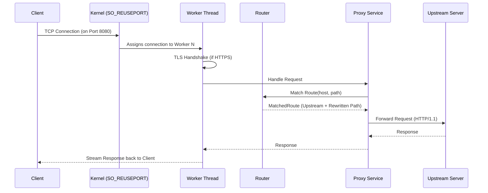

# Architecture Overview

This document describes the high-level architecture of the Barebones Reverse Proxy.

## System Components

The proxy is structured into several modular components:

1. **Orchestrator (`server.rs`)**: Responsible for reading the configuration, initializing shared resources (like the Router and TLS Acceptor), and spawning the worker threads.
2. **Worker Pool (`worker.rs`)**: A set of independent threads, each running its own asynchronous event loop.
3. **Router (`router.rs`)**: Encapsulates prefix-based route matching and path rewriting logic.
4. **Proxy Logic (`proxy.rs`)**: Implements the core request/response transformation and forwarding.
5. **TLS Support (`tls.rs`)**: Handles certificate loading and TLS session initialization.

## Request Lifecycle

Below is a sequence diagram showing how a request flows through the proxy from the client to the upstream server and back.

1. **Acceptance**: A client connects to the proxy on the configured `listen_port`. One of the worker threads accepts the TCP connection.
2. **TLS Handshake (Optional)**: If HTTPS is enabled, the worker performs a TLS handshake using `rustls`.
3. **HTTP Serving**: The `hyper` library takes over the stream and parses the incoming HTTP request.
4. **Routing**: The `ProxyState` uses the `Router` to match the `Host` and `Path` against the configuration.
5. **Forwarding**: The `ProxyState` uses a shared, pooled `hyper` client to forward the request to the upstream server.
6. **Response**: The response from the upstream is streamed back to the original client.

## Concurrency Model

The project adopts a **Shared-Nothing Concurrency** model:
- Each worker thread has its own **single-threaded Tokio runtime**.
- Worker threads do not share an event loop; they compete for incoming connections at the OS level using `SO_REUSEPORT`.
- This eliminates global locks on the acceptor and allows the proxy to scale linearly with the number of CPU cores.
