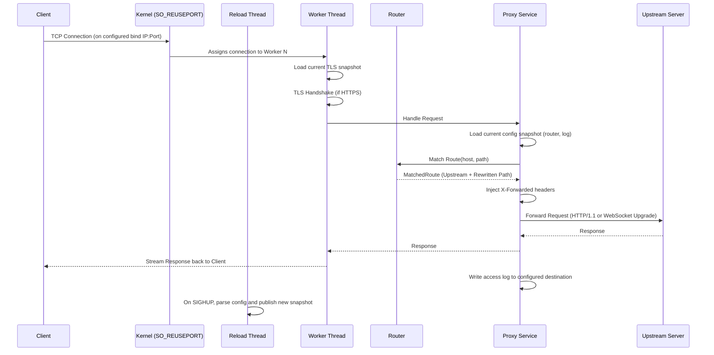

# Architecture Overview

This document describes the high-level architecture of the Barebones Reverse Proxy.

## System Components

The proxy is structured into several modular components:

1. **Orchestrator (`server.rs`)**: Responsible for reading the startup configuration, creating the live config store, spawning the worker threads, and running the reload supervisor thread.
2. **Runtime Config Store (`runtime_config.rs`)**: Owns immutable live config snapshots. The reload thread has the only writer handle; workers only receive read handles.
3. **Worker Pool (`worker.rs`)**: A set of independent threads, each running its own asynchronous event loop.
4. **Router (`router.rs`)**: Encapsulates prefix-based route matching and path rewriting logic.
5. **Proxy Logic (`proxy.rs`)**: Implements the core request/response transformation, header injection, and HTTP Upgrade/WebSocket forwarding.
6. **TLS Support (`tls.rs`)**: Builds an SNI-aware TLS resolver and loads hostname-specific certificate/key pairs.
7. **Logging (`log.rs`)**: Manages structured access and error logging, with support for zero-downtime log file rotation.

## Request Lifecycle

Below is a sequence diagram showing how a request flows through the proxy from the client to the upstream server and back.

1. **Acceptance**: A client connects to the proxy on the configured bind address and port. One of the worker threads accepts the TCP connection.
2. **TLS Snapshot Load**: Before the handshake, the worker reads the current immutable TLS snapshot from the live config store.
3. **TLS Handshake (Optional)**: If HTTPS is enabled, the worker performs a TLS handshake using `rustls`.
   The certificate served is selected from the SNI hostname supplied by the client.
4. **HTTP Serving**: The `hyper` library takes over the stream and parses the incoming HTTP request.
5. **Routing Snapshot Load**: The `ProxyState` reads the current immutable config snapshot (router, log file) from the live config store.
6. **Routing**: The `ProxyState` uses the `Router` to match the `Host` and `Path` against the configuration.
7. **Header Injection**: The `ProxyState` preserves the original `Host` and injects standard `X-Forwarded-For`, `X-Forwarded-Host`, and `X-Forwarded-Proto` headers.
8. **Forwarding**: The `ProxyState` uses a shared, pooled `hyper` client to forward the request to the upstream server. For WebSocket requests, it transparently bridges the connection via HTTP Upgrade.
9. **Response**: The response from the upstream is streamed back to the original client, and an access log entry is written to the snapshot's configured log destination.

## Reload Model

Configuration reload is intentionally asymmetric:

- The reload supervisor thread owns the only write-capable handle to the live config store.
- Worker threads only receive read-capable handles and cannot mutate the shared config.
- Reload builds a full new snapshot before publishing it, so invalid config never partially applies.
- `route` and `cert <hostname> { ... }` blocks are reloadable.
- `listen` and `workers` remain fixed for the lifetime of the process and are rejected during reload.

## Concurrency Model

The project adopts a mostly shared-nothing concurrency model:
- Each worker thread has its own **single-threaded Tokio runtime**.
- Worker threads do not share an event loop; they compete for incoming connections at the OS level using `SO_REUSEPORT`.
- Workers share only a read-only live config store, which is used to load immutable snapshots for routing and TLS.
- This eliminates global locks on the acceptor and keeps reload coordination outside the hot path for request processing.
