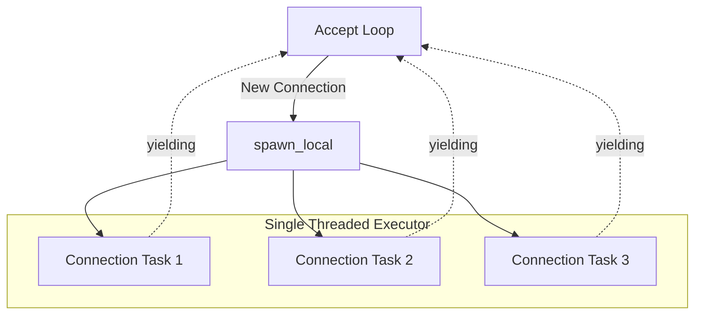

# Event Loop and Task Scheduling

This document details the internal event loop and task management within each worker thread.

## The "Current Thread" Runtime

Each worker thread runs a `tokio::runtime::Builder::new_current_thread()` runtime. Unlike the default "multi-threaded" runtime which uses a thread pool and work-stealing, the current-thread runtime is highly optimized for single-core execution and avoids the overhead of cross-thread synchronization.

## Task Isolation with `LocalSet`

Inside the worker, we use `tokio::task::LocalSet`. This ensures that every connection accepted by a specific worker is handled entirely within that worker's thread.



## The Accept Loop

The core of the worker is an asynchronous `loop`:

```rust
loop {
    let (stream, peer_addr) = listener.accept().await?;
    let active_config = config_reader.load();

    // Spawn a local task to handle this specific connection
    tokio::task::spawn_local(async move {
        // ... use the current TLS snapshot, then serve HTTP ...
    });
}
```

### Flow of a Connection
1.  **`listener.accept().await`**: The loop yields control to the Tokio reactor until a new connection is distributed to this specific worker by the kernel.
2.  **Load Current TLS Snapshot**: Before spawning the connection task, the worker reads the current immutable TLS config snapshot.
3.  **`spawn_local`**: Once a connection is accepted, a new "green thread" (task) is created.
4.  **Concurrency**: Because each connection is handled in its own `spawn_local` task, the worker can handle thousands of concurrent connections. While one task is waiting for an upstream response, the loop can accept next connection, or other active tasks can make progress.

## Serving HTTP

We use the `hyper_util::server::conn::auto::Builder` to serve connections. This builder is "protocol-aware":
- It automatically detects whether the incoming stream is **HTTP/1.1** or **HTTP/2**.
- It uses the `ProxyState` (which contains a read-only live config handle and the upstream `Client`) to handle the request.
- The `ProxyState` itself uses a `hyper::client::legacy::Client` which maintains a **connection pool** to upstream servers, further reducing latency by reusing established connections.

## Reload Behavior in the Event Loop

Reload does not interrupt worker runtimes.

- The reload supervisor thread listens for `SIGHUP`.
- It parses `proxy.conf`, builds a full new snapshot, and atomically publishes it.
- Connection tasks already in flight keep using the snapshot they captured.
- New handshakes and new requests observe the latest successful reload.
