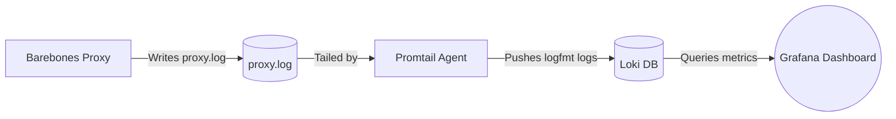

# Loki & Grafana Monitoring Overhaul Guide

This document outlines the step-by-step configuration for ingesting, parsing, and visualizing access logs from the **Barebones Reverse Proxy** using Grafana and Loki.

---

## 1. Monitoring Architecture

Our proxy writes access logs in structured `key=value` format (logfmt). The logs are collected and processed via the following pipeline:



---

## 2. Ingestion Setup (Promtail)

Promtail runs on the proxy server, monitors log files, and streams updates to Loki.

### A. Configuration File (`/etc/promtail/promtail-config.yaml`)

Create the Promtail configuration to tail the reverse proxy logfile and add job labels:

```yaml
server:
  http_listen_port: 9080
  grpc_listen_port: 0

positions:
  filename: /tmp/positions.yaml

clients:
  - url: http://localhost:3100/loki/api/v1/push

scrape_configs:
  - job_name: barebones-reverse-proxy
    static_configs:
      - targets:
          - localhost
        labels:
          job: barebones-reverse-proxy
          env: production
          __path__: /Users/hughstanway/Projects/Barebones-Reverse-Proxy/proxy.log # Replace with actual path to proxy logfile
```

### B. Systemd Service Configuration (`/etc/systemd/system/promtail.service`)

To run Promtail automatically on boot, create this systemd service file:

```ini
[Unit]
Description=Promtail client for sending logs to Loki
After=network.target

[Service]
Type=simple
User=root
ExecStart=/usr/local/bin/promtail -config.file=/etc/promtail/promtail-config.yaml
Restart=on-failure

[Install]
WantedBy=multi-user.target
```

Reload and start Promtail:
```bash
sudo systemctl daemon-reload
sudo systemctl enable --now promtail
```

---

## 3. Log Storage & Retention (Loki)

Loki requires minimal configuration to accept logfmt log lines. 

### A. Ingestion Mechanics
Because the proxy logs use `key=value` format, Loki's built-in **`logfmt`** parser automatically extracts fields on query time.
For example, a raw log line like:
```text
event=request peer=127.0.0.1:54321 client_ip=203.0.113.5 method=GET host=example.local path=/api/latest status=200 duration_ms=4.120 upstream=127.0.0.1:4000
```
Is parsed instantly by adding `| logfmt` to your query. Loki makes variables such as `status`, `duration_ms`, `host`, and `client_ip` immediately queryable as numeric or string attributes.

### B. Sample Loki Retention Config
Configure retention limits in your `/etc/loki/local-config.yaml` to prevent logs from filling the disk:

```yaml
limits_config:
  retention_period: 7d # Keep proxy logs for 7 days

compactor:
  working_directory: /tmp/loki/compactor
  shared_store: filesystem
  retention_enabled: true
```

---

## 4. Grafana Visualizations (Step-by-Step)

### A. Direct Import (Recommended)
We have prepared a pre-configured dashboard JSON file in this repository:
👉 [docs/dashboards/barebones_proxy_dashboard.json](./dashboards/barebones_proxy_dashboard.json)

1. Open Grafana and click the **+** (Import) button.
2. Copy and paste the contents of `barebones_proxy_dashboard.json` into the import box, or upload the file.
3. Select your **Loki** data source, and click **Import**.

---

### B. Manual Panel Construction
If you prefer to build the dashboard panels manually, configure them using the details below:

#### 1. Request Rate (QPS)
* **Panel Type**: Time Series
* **LogQL Query**:
  ```logql
  sum(rate({job="barebones-reverse-proxy"} | logfmt [1m]))
  ```
* **Graph Options**: Line interpolation: `Smooth`, Fill opacity: `15%`.
* **Field Configuration**: Unit: `requests/sec (reqps)`.

#### 2. Latency Percentiles (p50, p90, p99)
* **Panel Type**: Time Series
* **Queries**:
  * **p50 (Median)**: `quantile_over_time(0.50, {job="barebones-reverse-proxy"} | logfmt | unwrap duration_ms [5m])`
  * **p90**: `quantile_over_time(0.90, {job="barebones-reverse-proxy"} | logfmt | unwrap duration_ms [5m])`
  * **p99 (Tail Latency)**: `quantile_over_time(0.99, {job="barebones-reverse-proxy"} | logfmt | unwrap duration_ms [5m])`
* **Field Configuration**: Unit: `milliseconds (ms)`.

#### 3. Response Code Distribution
* **Panel Type**: Pie Chart
* **Query**:
  ```logql
  sum by (status) (count_over_time({job="barebones-reverse-proxy"} | logfmt [5m]))
  ```
* **Legend Formatting**: `{{status}}`

#### 4. Live Log Viewer
* **Panel Type**: Logs
* **Query**:
  ```logql
  {job="barebones-reverse-proxy"}
  ```
* **Logs Options**: Wrap log messages: `Enabled`, Prepend timestamp: `Enabled`.

---

## 5. Performance Monitoring & Alerts

Set up Grafana Alert Rules on your Loki metrics to be notified of outages or latency spikes:

### Alert A: High Upstream Failure Rate (502/504 Bad Gateway)
* **Trigger condition**: Rate of 5xx errors exceeds 1% of total requests over a 5-minute evaluation window.
* **LogQL Alert Query**:
  ```logql
  (sum(rate({job="barebones-reverse-proxy"} | logfmt | status >= 500 [5m]))
  /
  sum(rate({job="barebones-reverse-proxy"} | logfmt [5m]))) * 100 > 1
  ```

### Alert B: High Tail Latency (p95 Spike)
* **Trigger condition**: The p95 response time exceeds 500ms for more than 5 minutes (indicating slow upstream responses or worker bottlenecks).
* **LogQL Alert Query**:
  ```logql
  quantile_over_time(0.95, {job="barebones-reverse-proxy"} | logfmt | unwrap duration_ms [5m]) > 500
  ```
