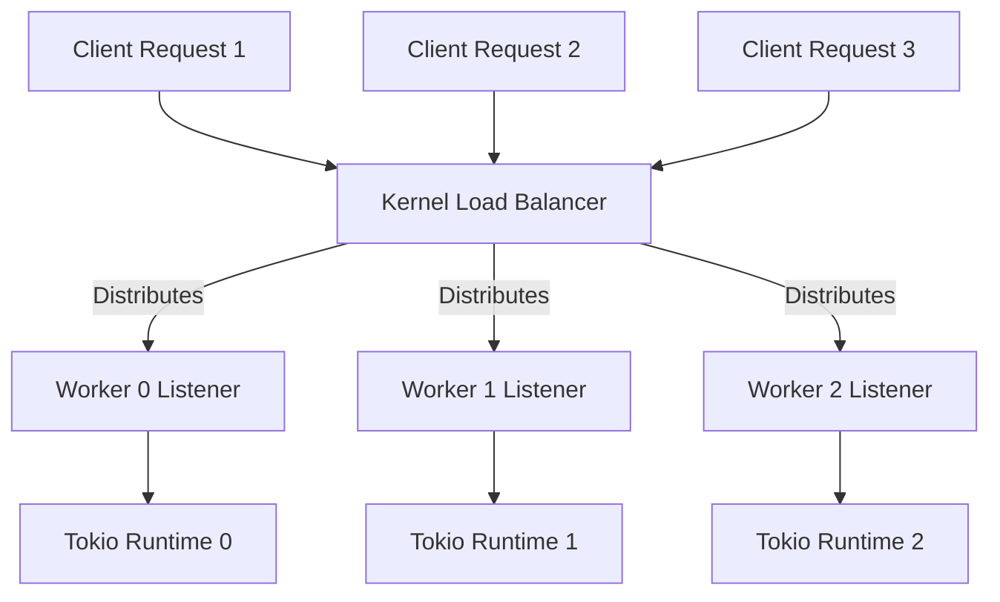

# Worker Threads and SO_REUSEPORT

This document explains how the proxy utilizes multiple threads and the `SO_REUSEPORT` socket option to achieve high concurrency.

## The Problem: Single Acceptor Bottleneck
In a traditional multi-threaded server, a single "boss" thread often handles all `accept()` calls and then hands off connections to "worker" threads. As connection rates increase, the single boss thread becomes a bottleneck, and the kernel lock on the listener socket creates contention.

## The Solution: `SO_REUSEPORT`
The Barebones Reverse Proxy uses the `SO_REUSEPORT` socket option. This allows multiple independent sockets (one per worker thread) to bind to the **exact same port**.



### Benefits
- **Kernel-Level Load Balancing**: The operating system kernel automatically distributes incoming TCP connections across the available listeners.
- **Zero Lock Contention**: Each worker thread has its own private listener and its own event loop. There is no shared state or locking between workers during the accept phase.
- **Linear Scaling**: You can configure the number of workers to match your CPU core count for maximum throughput.
- **Read-Only Config Access**: Workers can load the current config snapshot, but they do not own the writer handle and cannot modify live config.

## Worker Implementation details

In `src/server.rs`, the orchestrator spawns `N` standard OS threads:

```rust
for id in 0..self.workers {
    let config_reader = config_reader.clone();

    std::thread::Builder::new()
        .name(format!("worker-thread-{}", id))
        .spawn(move || {
            run_worker(id, addr, config_reader);
        });
}
```

Each thread then enters `run_worker` in `src/worker.rs`, where it:
1.  Creates a new **Single-Threaded** Tokio runtime.
2.  Creates a socket with `SO_REUSEPORT` enabled.
3.  Binds and listens on the shared port.
4.  Loads the current TLS snapshot for each accepted connection.
5.  Enters its own infinite `accept()` loop.

This architecture ensures that a slow-to-handshake TLS connection or a heavy request in one worker does not block the other workers from accepting new traffic.

## Worker Interaction with Reloads

Workers do not participate in config mutation.

- The reload thread validates and publishes a brand-new immutable config snapshot.
- On each accepted connection, a worker loads the latest TLS snapshot before the handshake.
- On each request, `ProxyState` loads the latest router snapshot before route matching.
- Existing connections continue on the snapshot they already captured, which is what makes reload zero-downtime.
